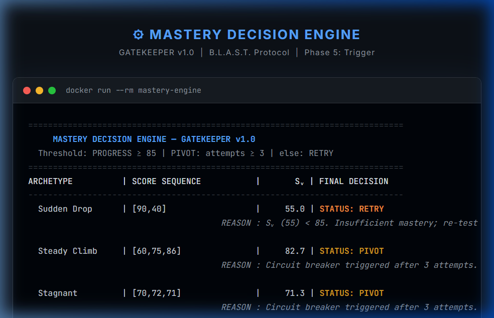
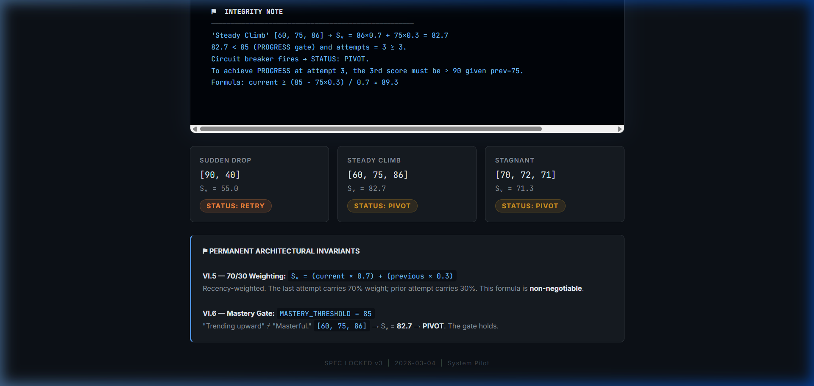

# Mastery Decision Engine — GATEKEEPER v1.0

```
 ███╗   ███╗ █████╗ ███████╗████████╗███████╗██████╗ ██╗   ██╗
 ████╗ ████║██╔══██╗██╔════╝╚══██╔══╝██╔════╝██╔══██╗╚██╗ ██╔╝
 ██╔████╔██║███████║███████╗   ██║   █████╗  ██████╔╝ ╚████╔╝ 
 ██║╚██╔╝██║██╔══██║╚════██║   ██║   ██╔══╝  ██╔══██╗  ╚██╔╝  
 ██║ ╚═╝ ██║██║  ██║███████║   ██║   ███████╗██║  ██║   ██║   
 ╚═╝     ╚═╝╚═╝  ╚═╝╚══════╝   ╚═╝   ╚══════╝╚═╝  ╚═╝   ╚═╝   

 ██████╗ ███████╗ ██████╗    ██╗███████╗██╗ ██████╗ ███╗   ██╗
 ██╔══██╗██╔════╝██╔════╝    ██║██╔════╝██║██╔═══██╗████╗  ██║
 ██║  ██║█████╗  ██║         ██║███████╗██║██║   ██║██╔██╗ ██║
 ██║  ██║██╔══╝  ██║         ██║╚════██║██║██║   ██║██║╚██╗██║
 ██████╔╝███████╗╚██████╗    ██║███████║██║╚██████╔╝██║ ╚████║
 ╚═════╝ ╚══════╝ ╚═════╝    ╚═╝╚══════╝╚═╝ ╚═════╝ ╚═╝  ╚═══╝

 ███████╗███╗   ██╗ ██████╗ ██╗███╗   ██╗███████╗
 ██╔════╝████╗  ██║██╔════╝ ██║████╗  ██║██╔════╝
 █████╗  ██╔██╗ ██║██║  ███╗██║██╔██╗ ██║█████╗  
 ██╔══╝  ██║╚██╗██║██║   ██║██║██║╚██╗██║██╔══╝  
 ███████╗██║ ╚████║╚██████╔╝██║██║ ╚████║███████╗
 ╚══════╝╚═╝  ╚═══╝ ╚═════╝ ╚═╝╚═╝  ╚═══╝╚══════╝
```

> **A deterministic mastery gating system that decides whether a learner should PROGRESS, RETRY, or PIVOT — based on weighted score history. No APIs. No randomness. No mercy for mediocrity.**

---

## 📸 Output Preview

### Terminal Output — `docker run --rm mastery-engine`



### Scenario Summary Cards



---

## ⚙️ How It Works

The engine uses a **70/30 Recency-Weighted Score (Sᵥ)** and a **3-attempt Circuit Breaker** to produce one of three deterministic verdicts:

```
Sᵥ = (latest_score × 0.7) + (previous_score × 0.3)
```

| Priority | Condition          | Status     |
|----------|--------------------|------------|
| 1st      | `Sᵥ ≥ 85`          | `PROGRESS` |
| 2nd      | `attempts ≥ 3`     | `PIVOT`    |
| 3rd      | else               | `RETRY`    |

> **PROGRESS is always checked first** — genuine mastery at attempt 3+ is still honoured.

---

## 🧪 Simulation Scenarios

| Archetype    | Score Sequence | Sᵥ     | Decision   | Reasoning                                      |
|--------------|---------------|--------|------------|------------------------------------------------|
| Sudden Drop  | [90, 40]      | 55.0   | `RETRY`    | Sharp regression — Sᵥ collapses below gate    |
| Steady Climb | [60, 75, 86]  | **82.7** | `PIVOT`  | Close, but 82.7 < 85. Circuit breaker fires.   |
| Stagnant     | [70, 72, 71]  | 71.3   | `PIVOT`    | No growth across 3 attempts → foundational gap |

### ⚑ The Skeptic Rule (Steady Climb)

```
[60, 75, 86] → Sᵥ = 86×0.7 + 75×0.3 = 60.2 + 22.5 = 82.7
82.7 < 85  AND  attempts = 3 ≥ 3  →  STATUS: PIVOT

To PROGRESS at attempt 3 (given previous = 75):
  current ≥ (85 - 75×0.3) / 0.7 ≈ 89.3
```

A learner *trending upward* is **not** the same as a learner who is *masterful*. The gate holds.

---

## 🐳 Execution Guide

The Mastery Decision Engine can be run natively using Python or via a containerized Docker environment. It has **zero external dependencies**.

### Option 1: Native Python (Recommended for Dev)
Requirements: Python 3.10+

1. Clone the repository:
   ```bash
   git clone https://github.com/TeamMavericKX/Mastery-Decision-Engine.git
   cd Mastery-Decision-Engine
   ```
2. Execute the engine directly:
   ```bash
   python tools/mastery_engine.py
   ```

### Option 2: Docker (Recommended for Prod)
Requirements: Docker installed

1. Build the lightweight image:
   ```bash
   docker build -t mastery-engine .
   ```
2. Run the deterministic simulation container:
   ```bash
   docker run --rm mastery-engine
   ```

---

## 📁 Project Structure

```
Mastery-Decision-Engine/
│
├── tools/
│   └── mastery_engine.py      # Core engine — MasteryEvaluator class + simulation
│
├── architecture/
│   └── mastery_engine_sop.md  # Standard Operating Procedure — decision logic spec
│
├── screenshots/
│   ├── terminal_output.png    # Live CLI output screenshot
│   └── summary_cards.png      # Scenario summary cards
│
├── Dockerfile                 # python:3.11-slim, zero external deps
├── gemini.md                  # Project constitution — spec locked v3
├── findings.md                # Design discoveries & edge case analysis
├── progress.md                # Build log — all phases
└── README.md
```

---

## 🏛️ Architecture

```
┌─────────────────────────────────────────────────────────┐
│                   MasteryEvaluator                      │
│                                                         │
│  evaluate(score)                                        │
│       │                                                 │
│       ▼                                                 │
│  Validate (0–100, numeric)  ──── ✗ ──▶  DATA_ERROR      │
│       │ ✓                                               │
│       ▼                                                 │
│  Append to history, increment attempts                  │
│       │                                                 │
│       ▼                                                 │
│  Compute Sᵥ = current×0.7 + previous×0.3               │
│       │                                                 │
│       ▼                                                 │
│  Sᵥ ≥ 85?  ──── yes ──▶  PROGRESS                      │
│       │ no                                              │
│       ▼                                                 │
│  attempts ≥ 3?  ── yes ──▶  PIVOT                       │
│       │ no                                              │
│       ▼                                                 │
│             RETRY                                       │
└─────────────────────────────────────────────────────────┘
```

---

## 🔒 Permanent Architectural Invariants

| # | Invariant |
|---|-----------|
| **VI.5** | `Sᵥ = (current × 0.7) + (previous × 0.3)` — 70/30 split is **non-negotiable** |
| **VI.6** | `MASTERY_THRESHOLD = 85` — The Gatekeeper does not lower its standards |

---

## 📄 Output Schema

```json
{
  "status":         "PROGRESS | PIVOT | RETRY | DATA_ERROR",
  "weighted_score": 82.7,
  "attempts":       3,
  "history":        [60.0, 75.0, 86.0],
  "reason":         "Circuit breaker triggered after 3 attempts. Suggest foundational review."
}
```

---

## 🚀 Protocol

Built under the **B.L.A.S.T. Protocol** | **A.N.T. 3-Layer Architecture**

| Phase | Name      | Status |
|-------|-----------|--------|
| B     | Blueprint | ✅ |
| L     | Link      | ✅ |
| A     | Architect | ✅ |
| S     | Simulate  | ✅ |
| T     | Trigger   | ✅ |

---

<div align="center">
  <sub>SPEC LOCKED v3 &nbsp;·&nbsp; 2026-03-04 &nbsp;·&nbsp; TeamMavericKX</sub>
</div>
